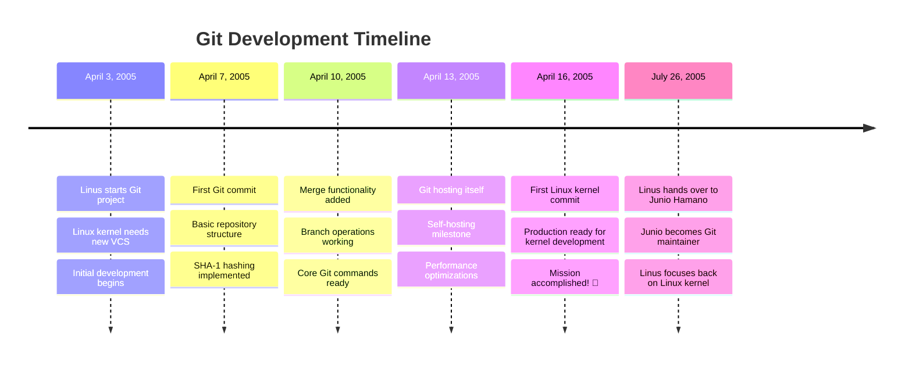
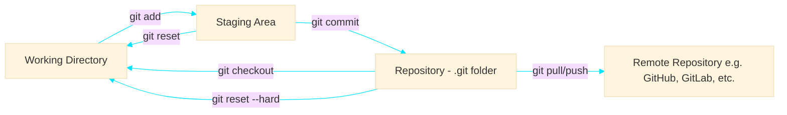

# Git for Software Engineers

Master the tool that powers collaboration, version control, and modern software development.

<div class="pt-12">
  <span @click="$slidev.nav.next" class="px-2 py-1 rounded cursor-pointer" hover:bg="gray hover:bg-opacity-1" >
    by AnuchitO
  </span>
</div>

<div class="abs-br m-6 flex gap-2">
  <button @click="$slidev.nav.openInEditor()" title="Open in Editor" class="text-xl slidev-icon-btn opacity-50 !border-none !hover:text-white">
    <carbon:edit />
  </button>
  <a href="https://github.com/AnuchitO/course-git" target="_blank" alt="GitHub" title="Open in GitHub"
    class="text-xl slidev-icon-btn opacity-50 !border-none !hover:text-white">
    <carbon-logo-github />
  </a>
</div>

<!--
Welcome to Git for Software Engineers! This course will take you from Git basics to advanced workflows used in professional software development.
-->

<!-- I want to introduction slide that when we talk about git it not github, gitlab, bitbucket those just use git we talk about it itself. -->

---

# Important: Git ≠ GitHub/GitLab/Bitbucket

Before we dive in, let's clarify what we're actually learning about.

<div class="grid grid-cols-2 gap-12 mt-8">
  <div>

  ##  Git (the actual tool) 🛠️
  - **Distributed Version control system**
  - **Command-line software** that runs locally
  - **Open source** and completely free
  - **Works offline** on your machine
  - **Core functionality**: track changes, branches, history

    <div class="mt-6 p-4 bg-green-100 dark:bg-green-900 rounded">
    ✅ <strong>This course focuses on Git itself</strong>
    </div>

  </div>

<div>

## Git Hosting Platforms 🌐

<div class="flex items-center gap-4 mb-6">
  <div class="w-12 h-12 rounded flex items-center justify-center">
    
  </div>
  <div class="w-12 h-12 rounded flex items-center justify-center">
    
  </div>
  <div class="w-12 h-12 rounded flex items-center justify-center">
    
  </div>
<div class="w-12 h-12 rounded flex items-center justify-center bg-black dark:bg-transparent">
    
  </div>
</div>

- **Web services** that host Git repositories
- **Additional features**: Issues, CI/CD, Wiki
- **Team collaboration** tools
- **Built on top of Git** - they use Git underneath

</div>

</div>


---

# What is Git?

Git is a **distributed version control system** that tracks changes in files and coordinates work among multiple developers.

<div class="grid grid-cols-2 gap-8 mt-8">

<div>

## Why Git?

- 📈 **Track changes** over time
- 🤝 **Collaborate** with teams
- 🔄 **Backup** and sync code
- 🌿 **Branch** for features
- ⏪ **Rollback** mistakes
- 📊 **Audit** code history

</div>

<div>

## Git vs Others

| Feature     | Git | SVN | Mercurial | BitKeeper |
|-------------|-----|-----|-----------|-----------|
| Distributed | ✅   | ❌   | ✅         | ✅         |
| Speed       | ⚡   | 🐌  | ⚡         | ⚡         |
| Branching   | 🌟  | 😐  | 👍        | 👍        |
| Popularity  | 🔥  | 📉  | 📉        | 📉        |
| Open Source | ✅   | ✅   | ✅         | ❌         |
</div>

</div>

<!--
Git revolutionized version control by being distributed - every developer has a complete copy of the project history. This enables offline work and makes collaboration more flexible.
-->

---

# Git: [The Stupid Content Tracker](https://github.com/git/git/commits/master/?since=2005-04-07&until=2005-04-07)

Understanding Git's original design philosophy and core architecture.

<div class="grid grid-cols-2 gap-8 mt-8">

<div>

## What "Git" Means 🤔

According to Linus Torvalds, "git" can mean:

- **Random three-letter combination** that's pronounceable
- **Stupid, contemptible, despicable** - take your pick from slang dictionary
- **"Global Information Tracker"** - when you're in a good mood ✨
- **"Goddamn Idiotic Truckload of Sh*t"** - when it breaks 💥

<div class="mt-2 p-3 bg-yellow-100 dark:bg-yellow-900 rounded text-xs">
💡 It's a <strong>stupid but extremely fast</strong> directory content manager
</div>

</div>

<div>

Git was created by Linus Torvalds in 2005 to replace BitKeeper, which Linux kernel development was using but wasn't open source.

<div>

<div class="flex items-center gap-4 mb-4">
  
  <div>
    <p class="font-semibold">Linus Torvalds</p>
    <p class="text-sm opacity-75">Creator of Git & Linux</p>
  </div>
</div>

</div>

</div>
</div>

<!--
In 2005, Andrew Tridgell, the creator of Samba and rsync, reverse-engineered the BitKeeper protocol by connecting to a BitKeeper server and analyzing the network traffic. BitMover (the company behind BitKeeper) considered this a violation of their license terms.

This incident led to BitMover revoking the free license that the Linux kernel development community had been using for BitKeeper. Larry McVoy (BitKeeper's creator) was particularly upset about this reverse engineering attempt.
-->

---

# The Linux Kernel Migration Challenge

Understanding the scale of what Git needed to handle from day one.

<div class="grid grid-cols-2 gap-4 mt-2">

<div>

## Linux Kernel by Numbers (2005)

<div class="space-y-4 mt-2">
  <div class="flex justify-between items-center p-3 bg-blue-100 dark:bg-blue-900 rounded">
    <span class="font-semibold">Lines of Code</span>
    <span class="text-xl font-bold text-blue-600">~6.6 Million</span>
  </div>

  <div class="flex justify-between items-center p-3 bg-green-100 dark:bg-green-900 rounded">
    <span class="font-semibold">Active Developers</span>
    <span class="text-xl font-bold text-green-600">~1,000+</span>
  </div>

  <div class="flex justify-between items-center p-3 bg-purple-100 dark:bg-purple-900 rounded">
    <span class="font-semibold">Files</span>
    <span class="text-xl font-bold text-purple-600">~17,000</span>
  </div>

  <div class="flex justify-between items-center p-3 bg-red-100 dark:bg-red-900 rounded">
    <span class="font-semibold">Commits per Day</span>
    <span class="text-xl font-bold text-red-600">~100-200</span>
  </div>
</div>

</div>

<div>

## The Migration Challenge 🚀

**BitKeeper History to Preserve:**
- Thousands of commits from hundreds of developers
- Complex branching and merging patterns
- Detailed commit metadata and authorship

**Git's First Test:**
- Handle massive repository size
- Support distributed development
- Enable fast branching/merging
- Maintain complete history integrity

</div>

</div>

---

# Performance Requirements

| **Requirement** | **Challenge**               | **Git's Solution**        |
|-----------------|-----------------------------|---------------------------|
| **Speed**       | Handle 100+ commits/day     | Optimized data structures |
| **Scale**       | Support 1000+ developers    | Distributed architecture  |
| **Integrity**   | Preserve 3+ years history   | SHA-1 checksums           |
| **Branching**   | Complex feature development | Lightweight branches      |


<div class="mt-6 p-4 bg-yellow-100 dark:bg-yellow-900 rounded">
💡 <strong>Amazing Fact:</strong> Git successfully migrated the entire Linux kernel history and became the primary VCS within weeks of its creation!
</div>

<!--
The Linux kernel was the perfect stress test for Git. If it could handle one of the world's largest and most active software projects, it could handle anything. This real-world pressure shaped Git's design from the very beginning.
-->


---

# Git Development Timeline

The 10-Day Git Creation (April 2005)



---
class: text-xs
---

# Types of Version Control Systems (VSC)

Understanding the evolution of version control helps appreciate Git's advantages.

<div class="grid grid-cols-3 gap-4">

<div class="p-6 border rounded-lg">

##### 📁 Local VCS (LVCS)

<div class="mt-4 mb-4">
  
</div>

- RCS (Revision Control System)
- SCCS (Source Code Control System)
- Local file copying

<div class="mt-4 p-3 bg-red-100 dark:bg-red-900 rounded text-sm">
❌ <strong>Limitations:</strong> No backup, no collaboration
</div>

</div>

<div class="p-6 border rounded-lg">

##### 🌐 Centralized VCS (CVCS)

<div class="mt-4 mb-4">
  
</div>

- **Subversion (SVN)**
- **CVS (Concurrent Versions System)**
- **Perforce**
- **Team Foundation Server (TFS)**

<div class="mt-4 p-3 bg-yellow-100 dark:bg-yellow-900 rounded text-sm">
⚠️ <strong>Issues:</strong> Single point of failure, requires network
</div>

</div>

<div class="p-6 border-4 border-green-500 rounded-lg">

##### 🔄 Distributed VCS (DVCS)

<div class="mt-4 mb-4">
  
</div>


- **Git** ⭐
- **Mercurial (Hg)**
- **Bazaar**

<div class="mt-4 p-3 bg-green-100 dark:bg-green-900 rounded text-sm">
✅ <strong>Advantages:</strong> Offline work, multiple backups, flexible workflows
</div>

</div>

</div>

<div class="mt-8 p-4 bg-blue-100 dark:bg-blue-900 rounded">
💡 <strong>Evolution:</strong> LVCS → CVCS → DVCS represents the progression toward more flexible and robust version control
</div>

<!--
The evolution from local to centralized to distributed version control reflects the growing needs of software development teams. Git's distributed nature makes it incredibly flexible and resilient.
-->


---

# Git Architecture

Understanding Git's three-tree architecture is crucial for mastering Git.



<div class="grid grid-cols-3 gap-4 mt-8">

<div class="p-4 border rounded">
<h3>🗂️ Working Directory</h3>
Your current files and folders where you make changes
</div>

<div class="p-4 border rounded">
<h3>  Git Staging Area</h3>
Prepared changes ready to be committed <br/>(like a shopping cart)
</div>

<div class="p-4 border rounded">
<h3>📚 Repository</h3>
Permanent storage of committed snapshots <br/> (.git folder)
</div>

</div>

<!--
Think of Git as a camera: Working Directory is what you see, Staging Area is what you frame, and Repository is the photo album of snapshots you've taken.
-->

---

# Git Installation

<div class="flex justify-center mt-4 mb-8">
  
</div>

<div class="grid grid-cols-3 gap-3 mt-8">
  <div>
    <div>
      <h3><carbon:download class="inline text-2xl mr-2" /> Download Git</h3>
    </div>

  Visit **[git-scm.com](https://git-scm.com/downloads)** to download Git for your operating system.

  </div>

<div class="col-span-2">
    <div>
      <h3><carbon:terminal class="inline text-2xl mr-2" /> Installation</h3>
    </div>

  - **Windows:** Download installer from  **[git-scm.com](https://git-scm.com/downloads)** and run it
  - **macOS:** `brew install git`
  - **Linux:**
    - `sudo apt install git` (Ubuntu/Debian)
    - `sudo yum install git` (CentOS/RHEL)

  </div>

</div>

---

# Essential Git Commands

Let's start with the fundamental commands every developer needs to know.

<div class="grid grid-cols-2 gap-8">

<div>

## Getting Started
```bash
# Initialize a new repository
git init

# Check repository status
git status

# View commit history
git log
```

</div>

<div>

## Basic Workflow
```bash
# Stage files for commit
git add <file>

# Commit staged changes
git commit -m "Your message"

# View commit history
git log
```

</div>

</div>

<div class="mt-8 p-4 bg-yellow-100 dark:bg-yellow-900 rounded">
💡 <strong>Pro Tip:</strong> Use <code>git status</code> frequently - it's your best friend for understanding what's happening!
</div>

<!--
These commands form the core Git workflow. Practice them until they become muscle memory. The key is understanding what each command does to the three trees.
-->

---


#### 📝 Assignment: Create Your First Repository

**Task 1:** Create a new project folder and initialize Git

```bash
mkdir thaichat # Step 1: Create a new folder called 'thaichat'
cd thaichat # Step 2: Navigate into the folder

git init # Step 3: Initialize Git repository
# Step 4: Verify Git initialization
ls -la  # You should see a .git folder

git branch -m main # rename current branch to main
```

<div v-click>

**Task 2:** Configure default branch to be `main`

```bash
# Configure Git to use 'main' as the default branch name
git config --global init.defaultBranch main

# Navigate back to parent directory and create a new demo project
cd ../
mkdir demo
cd demo

# Initialize Git repository (should not show hints about default branch)
git init # the default branch should be `main`
```

</div>


---

# Exploring .git & First Commit

##### 1. Explore the .git directory
```bash
ls -la .git # See what's inside the .git directory
git status
git log
```

##### 2. Create your first commit
```bash
echo "# ThaiChat - A most popular real-time chat application in Thailand" > README.md
git status

git add README.md
git status

git commit -m "A: my first commit"
```

##### 3. Config user name and email
```bash
  git config --global user.email "you@example.com" # you can try with out --global and commit in demo/ folder see the difference
  git config --global user.name "Your Name"
```

##### 4. then we can comit
```bash
git commit -m "A: my first commit"
git log
```

---

# Git Config: Local vs Global

option `--global` will apply to all repositories

#### Local Configuration (Specific to current repository, stored in .git/config)
```bash
# Navigate to your project
cd thaichat/
cat .git/config
git config --list # Check effective config

cd demo/
cat .git/config
git config --local user.email "email@demo.com" # or `git config user.email "email@demo.com"`
git config --local user.name "Demo" # or `git config user.name "Demo"`
```

#### Verify in Different Directories
```bash
# In thaichat/
cd ~/projects/thaichat
git config user.email  # Shows dev@thaichat.com

# In demo/
cd ~/projects/demo
git config user.email  # Shows email@demo.com
```

---

# Git Configuration Scopes

Git has three configuration levels that determine where settings are stored and their priority.

<div class="flex justify-center">
  
</div>

---

# Porcelain and Plumbing

Git commands are divided into **high-level commands** (porcelain) and **low-level commands** (plumbing).

<div class="grid grid-cols-2 gap-12 mt-8">
  <div>

  ## Porcelain Commands 🚿

 you will use most often as a developer to interact with your code

<div class="grid grid-cols-2 gap-12 mt-8">
  <div>
    <ul>
      <li><code>git status</code></li>
      <li><code>git add</code></li>
      <li><code>git commit</code></li>
    </ul>
  </div>
  <div>
    <ul>
      <li><code>git push</code></li>
      <li><code>git pull</code></li>
      <li><code>git log</code></li>
    </ul>
  </div>
  </div>

  <div class="mt-6 p-4 bg-green-100 dark:bg-green-900 rounded">
  ✅ <strong>These are your daily Git tools</strong>
  </div>

  </div>

<div>

## Plumbing Commands 🔧

Low-level commands that manipulate Git's internal structures. Rarely used directly

  <ul>
    <li><code>git cat-file</code></li>
    <li><code>git apply</code></li>
    <li><code>git commit-tree</code></li>
    <li><code>git hash-object</code></li>
    <li><code>git ls-tree</code></li>
  </ul>

  <div class="mt-6 p-4 bg-yellow-100 dark:bg-yellow-900 rounded">
    Understanding plumbing helps with porcelain
  </div>

</div>

</div>

---

# Git Cat-File - Exploring Git Objects

a powerful plumbing tool that lets you examine the raw contents and metadata of Git objects like blobs, trees, commits, and tags.

<div class="grid grid-cols-2 gap-8">

  <div>

  - **Blobs** - file contents
  - **Trees** - directory structures
  - **Commits** - snapshots with metadata
  - **Tags** - annotated references

  ```bash
  # Basic syntax
  git cat-file <type> <object>
  git cat-file -t <object>  # show type
  git cat-file -s <object>  # show size
  git cat-file -p <object>  # pretty print
  ```

  </div>
    <div class="flex justify-center mt-8">
      
    </div>
  <div>

  </div>
</div>


---

# Git Object Inspection

#### Using `git cat-file` with ThaiChat

```bash
# 1. Navigate to ThaiChat and check status
cd ~/work/thaichat
git status

git --no-pager log --parents --oneline

git cat-file -p <commit-hash> # could be <commit-hash>, <tree-hash>, <blob-hash>
ls -al .git/

echo "Most popular chat for Thai people" >> chat.md
git add chat.md
git commit -m "B: most popular chat"

git --no-pager log --parents --oneline  # Copy the commit hash

git cat-file -p <commit-hash>  # then cat tree-hash to see blob objects

git ls-tree HEAD  # Both README files point to same blob hash
git ls-tree <tree-hash> # tree hash of first commit
```

##### 💡 **Key Insight**: Git's content-addressable storage means identical files are stored only once, saving space and maintaining history efficiently.

---

# Git Object Model

everything in Git is stored as objects (blobs for files, trees for directories, commits for snapshots) linked by SHA-1 hashes.

<div class="flex justify-center">

<div class="flex justify-center">
  
</div>
</div>

<div class="mt-2 p-4 bg-blue-100 dark:bg-blue-900 rounded">
💡 <strong>Key Insight:</strong> store objects - commits, trees, and blobs form a directed acyclic graph (DAG)
</div>

<!--
Git's object model is elegant in its simplicity. Every piece of data is stored as an object with a SHA-1 hash. Understanding this model helps you grasp why Git operations work the way they do.
-->

---

# Hands-on: Your First Repository

Let's create your first Git repository and make some commits step by step.

````md magic-move {lines: true}
```bash
# Step 1: Initialize a new repository
mkdir my-project
cd my-project
git init
```

```bash
# Step 1: Initialize a new repository
mkdir my-project
cd my-project
git init

# Step 2: Create initial files
echo "# My Project" > README.md
echo "console.log('Hello Git!');" > app.js
```

```bash
# Step 1: Initialize a new repository
mkdir my-project
cd my-project
git init

# Step 2: Create initial files
echo "# My Project" > README.md
echo "console.log('Hello Git!');" > app.js

# Step 3: Check status and stage files
git status
git add .
```

```bash
# Step 1: Initialize a new repository
mkdir my-project
cd my-project
git init

# Step 2: Create initial files
echo "# My Project" > README.md
echo "console.log('Hello Git!');" > app.js

# Step 3: Check status and stage files
git status
git add .

# Step 4: Make your first commit
git commit -m "Initial commit: Add README and app.js"
```

```bash
# Step 1: Initialize a new repository
mkdir my-project
cd my-project
git init

# Step 2: Create initial files
echo "# My Project" > README.md
echo "console.log('Hello Git!');" > app.js

# Step 3: Check status and stage files
git status
git add .

# Step 4: Make your first commit
git commit -m "Initial commit: Add README and app.js"

# Step 5: Make changes and commit again
echo "This is a sample project for learning Git" >> README.md
git add README.md
git commit -m "Update README with description"
```
````

<div class="mt-4 p-3 bg-green-100 dark:bg-green-900 rounded text-sm">
✅ <strong>Success!</strong> Click through each step to see the complete Git workflow!
</div>


---

# Hands-on: Continue


````md magic-move {lines: true}
```bash

# Step 5: Make changes and commit again
echo "This is a sample project for learning Git" >> README.md
git add README.md
git commit -m "Update README with description"

# Step 6: View your commit history
git log --oneline
git log --graph --oneline --all
```
````

<div class="mt-4 p-3 bg-green-100 dark:bg-green-900 rounded text-sm">
✅ <strong>Success!</strong> Click through each step to see the complete Git workflow!
</div>

<!--
This hands-on exercise demonstrates the basic Git workflow. Notice how each commit creates a snapshot of your project at that point in time.
-->


---

# Understanding Commits

A commit is a snapshot of your project at a specific point in time.

<div class="grid grid-cols-2 gap-8">

<div>

## Commit Anatomy
```bash
commit a1b2c3d4e5f6...
Author: John Doe <john@example.com>
Date: Mon Jan 15 10:30:00 2024 +0000

    Fix user authentication bug

    - Validate token expiration
    - Add error handling for invalid tokens
    - Update tests for auth module
```

</div>

<div>

## Commit Best Practices

### Good Messages ✅
- `Fix login validation for empty passwords`
- `Add user profile API endpoint`
- `Refactor database connection logic`

### Bad Messages ❌
- `fix bug`
- `update stuff`
- `asdf`

</div>

</div>

## Commit Message Format

```
<type>: <subject>

<body>

<footer>
```

**Types:** feat, fix, docs, style, refactor, test, chore

<!--
Good commit messages are like good documentation - they help future you and your teammates understand what changed and why. Treat each commit as a logical unit of change.
-->

---

# Branching Fundamentals

Branches allow you to work on different features simultaneously without affecting the main codebase.

```mermaid
gitgraph
    commit id: "Initial"
    commit id: "Add login"
    branch feature/signup
    checkout feature/signup
    commit id: "Add signup form"
    commit id: "Add validation"
    checkout main
    commit id: "Fix bug"
    merge feature/signup
    commit id: "Release v1.0"
```

## Practical Branching Workflow

````md magic-move {lines: true}
```bash
# Start: Check current branch and status
git branch
git status
```

```bash
# Start: Check current branch and status
git branch
git status

# Create a new feature branch
git branch feature/user-authentication
git branch  # see all branches
```

```bash
# Start: Check current branch and status
git branch
git status

# Create a new feature branch
git branch feature/user-authentication
git branch  # see all branches

# Switch to the new branch
git checkout feature/user-authentication
# or use the newer command
git switch feature/user-authentication
```

```bash
# Start: Check current branch and status
git branch
git status

# Create a new feature branch
git branch feature/user-authentication
git branch  # see all branches

# Switch to the new branch
git checkout feature/user-authentication
# or use the newer command
git switch feature/user-authentication

# Shortcut: Create and switch in one command
git checkout -b feature/user-profile
```

```bash
# Start: Check current branch and status
git branch
git status

# Create a new feature branch
git branch feature/user-authentication
git branch  # see all branches

# Switch to the new branch
git checkout feature/user-authentication

# Shortcut: Create and switch in one command
git checkout -b feature/user-profile

# Work on your feature, then merge back
git checkout main
git merge feature/user-authentication
git branch -d feature/user-authentication  # delete merged branch
```
````

<div class="mt-4 p-3 bg-blue-100 dark:bg-blue-900 rounded text-sm">
💡 <strong>Branch Naming:</strong> feature/user-auth, bugfix/login-error, hotfix/security-patch
</div>

<!--
Think of branches as parallel universes where you can experiment without affecting the main timeline. This is one of Git's most powerful features.
-->

---

# Merging Strategies

There are different ways to combine branches, each with its own use cases.

<div class="grid grid-cols-2 gap-8">

<div>

## Fast-Forward Merge
When target branch hasn't changed:

```bash
git checkout main
git merge feature/quick-fix
```

```mermaid
gitgraph
    commit id: "A"
    commit id: "B"
    branch feature
    commit id: "C"
    commit id: "D"
    checkout main
    merge feature
```

</div>

<div>

## Three-Way Merge
When both branches have new commits:

```bash
git checkout main
git merge feature/complex-feature
```

```mermaid
gitgraph
    commit id: "A"
    commit id: "B"
    branch feature
    commit id: "C"
    checkout main
    commit id: "D"
    merge feature
    commit id: "Merge"
```

</div>

</div>

## Merge vs Rebase

| Merge                    | Rebase            |
|--------------------------|-------------------|
| Preserves history        | Linear history    |
| Shows branch context     | Cleaner timeline  |
| Safe for shared branches | Rewrites history  |
| `git merge feature`      | `git rebase main` |

<!--
Choose merge for preserving context and rebase for clean history. Never rebase shared branches - it can cause problems for other developers.
-->

---

# Handling Merge Conflicts

Conflicts occur when Git can't automatically merge changes. Let's see how to resolve them step by step.

## Conflict Resolution Workflow

````md magic-move {lines: true}
```bash
# Scenario: Merging feature branch into main
git checkout main
git merge feature/auth-refactor
```

```bash
# Scenario: Merging feature branch into main
git checkout main
git merge feature/auth-refactor

# Output: Conflict detected!
# Auto-merging auth.js
# CONFLICT (content): Merge conflict in auth.js
# Automatic merge failed; fix conflicts and then commit the result.
```

```bash
# Scenario: Merging feature branch into main
git checkout main
git merge feature/auth-refactor

# Output: Conflict detected!
# Auto-merging auth.js
# CONFLICT (content): Merge conflict in auth.js
# Automatic merge failed; fix conflicts and then commit the result.

# Step 1: Check which files have conflicts
git status
```

```bash
# Step 1: Check which files have conflicts
git status

# Output shows:
# Unmerged paths:
#   (use "git add <file>..." to mark resolution)
#         both modified:   auth.js

# Step 2: Open the conflicted file and you'll see:
```

```bash
// The conflicted file (auth.js) looks like this:
// <<<<<<< HEAD
function login(username, password) {
    return authenticate(username, password);
}
// =======
function login(user, pass) {
    return auth.validate(user, pass);
}
// >>>>>>> feature/auth-refactor
```

```bash
# Step 3: Resolve the conflict by choosing or combining changes
function login(username, password) {
    return auth.validate(username, password);
}
# Remove conflict markers and keep the best parts
```

```bash
# Step 4: Stage the resolved file and commit
git add auth.js
git status  # should show "All conflicts fixed"
git commit  # Git will create a merge commit message
```
````

<div class="mt-4 p-3 bg-yellow-100 dark:bg-yellow-900 rounded text-sm">
💡 <strong>Pro Tip:</strong> Use <code>git merge --abort</code> if you want to cancel the merge and start over!
</div>

<!--
Conflicts are a normal part of collaborative development. The key is to stay calm, understand what each side is trying to do, and make thoughtful decisions about which changes to keep.
-->

---

# Remote Repositories

Remote repositories enable collaboration and backup. Let's see how to work with them step by step.

## Setting Up and Working with Remotes

````md magic-move {lines: true}
```bash
# Start with a local repository
git init my-awesome-project
cd my-awesome-project
echo "# My Awesome Project" > README.md
git add README.md
git commit -m "Initial commit"
```

```bash
# Start with a local repository
git init my-awesome-project
cd my-awesome-project
echo "# My Awesome Project" > README.md
git add README.md
git commit -m "Initial commit"

# Add a remote repository (create one on GitHub first)
git remote add origin https://github.com/AnuchitO/my-awesome-project.git
```

```bash
# Add a remote repository (create one on GitHub first)
git remote add origin https://github.com/AnuchitO/my-awesome-project.git

# Check your remotes
git remote -v
# origin  https://github.com/AnuchitO/my-awesome-project.git (fetch)
# origin  https://github.com/AnuchitO/my-awesome-project.git (push)
```

```bash
# Check your remotes
git remote -v

# Push your local commits to remote
git push -u origin main
# -u sets upstream tracking for future pushes
```

```bash
# Push your local commits to remote
git push -u origin main

# Now you can simply use:
git push  # pushes to origin main automatically

# Pull changes from remote
git pull origin main
# or just: git pull
```
````

## Clone and Contribute Workflow

````md magic-move {lines: true}
```bash
# Clone an existing repository
git clone https://github.com/AnuchitO/awesome-project.git
cd awesome-project
```

```bash
# Clone an existing repository
git clone https://github.com/AnuchitO/awesome-project.git
cd awesome-project

# Create a feature branch for your work
git checkout -b feature/add-user-authentication
```

```bash
# Create a feature branch for your work
git checkout -b feature/add-user-authentication

# Make your changes
echo "// Authentication logic here" > auth.js
git add auth.js
git commit -m "Add authentication module"
```

```bash
# Make your changes
echo "// Authentication logic here" > auth.js
git add auth.js
git commit -m "Add authentication module"

# Push your feature branch to remote
git push origin feature/add-user-authentication
```

```bash
# Push your feature branch to remote
git push origin feature/add-user-authentication

# Now create a Pull Request on GitHub
# After PR is merged, clean up:
git checkout main
git pull origin main
git branch -d feature/add-user-authentication
```
````

<div class="mt-4 p-4 bg-blue-100 dark:bg-blue-900 rounded">
💡 <strong>Pro Tip:</strong> Use <code>git fetch</code> to download changes without merging, then <code>git merge</code> when you're ready!
</div>

<!--
Understanding remotes is crucial for team collaboration. Think of remotes as synchronized copies of your repository that multiple developers can access.
-->

---

# Advanced Git Operations

Let's explore powerful Git features for managing complex scenarios.

## Git Stash - Save Work in Progress

````md magic-move {lines: true}
```bash
# Scenario: You're working on a feature but need to switch branches urgently
# You have uncommitted changes that aren't ready to commit yet
git status
```

```bash
# Scenario: You're working on a feature but need to switch branches urgently
# You have uncommitted changes that aren't ready to commit yet
git status

# Stash your current changes
git stash
# or with a descriptive message
git stash save "WIP: refactoring authentication logic"
```

```bash
# Stash your current changes
git stash save "WIP: refactoring authentication logic"

# Now you can switch branches safely
git checkout main
# do urgent work...
git checkout feature/auth-refactor
```

```bash
# Now you can switch branches safely
git checkout main
# do urgent work...
git checkout feature/auth-refactor

# Get your stashed changes back
git stash list  # see all stashes
git stash pop   # apply and remove latest stash
```

```bash
# Get your stashed changes back
git stash list  # see all stashes
git stash pop   # apply and remove latest stash

# Alternative: apply without removing from stash
git stash apply stash@{0}
git stash drop stash@{0}  # manually remove when ready
```
````

## Git Reset - Undo Changes

````md magic-move {lines: true}
```bash
# Different types of reset for different scenarios
git log --oneline  # see recent commits
```

```bash
# Different types of reset for different scenarios
git log --oneline  # see recent commits

# Soft reset: Undo commit but keep changes staged
git reset --soft HEAD~1
git status  # changes are still staged
```

```bash
# Soft reset: Undo commit but keep changes staged
git reset --soft HEAD~1
git status  # changes are still staged

# Mixed reset (default): Undo commit and unstage changes
git reset HEAD~1
git status  # changes are in working directory
```

```bash
# Mixed reset (default): Undo commit and unstage changes
git reset HEAD~1
git status  # changes are in working directory

# Hard reset: ⚠️ DANGER - Completely remove commit and changes
git reset --hard HEAD~1
# Changes are permanently lost!
```
````

<div class="mt-4 p-4 bg-red-100 dark:bg-red-900 rounded">
⚠️ <strong>Warning:</strong> <code>git reset --hard</code> permanently deletes changes. Always stash or commit important work first!
</div>

<!--
These advanced operations give you fine-grained control over your Git history. Stash is great for quickly switching contexts, while reset helps you undo mistakes.
-->

---

# Git Workflows

Different teams use different Git workflows. Let's see the most popular ones in action.

## GitHub Flow - Simple and Effective

````md magic-move {lines: true}
```bash
# GitHub Flow: Perfect for continuous deployment
# Step 1: Always start from main
git checkout main
git pull origin main
```

```bash
# GitHub Flow: Perfect for continuous deployment
# Step 1: Always start from main
git checkout main
git pull origin main

# Step 2: Create a feature branch
git checkout -b feature/user-profile-page
```

```bash
# Step 2: Create a feature branch
git checkout -b feature/user-profile-page

# Step 3: Work on your feature
echo "<h1>User Profile</h1>" > profile.html
git add profile.html
git commit -m "Add user profile page structure"
```

```bash
# Step 3: Work on your feature
echo "<h1>User Profile</h1>" > profile.html
git add profile.html
git commit -m "Add user profile page structure"

# Step 4: Push and create Pull Request
git push origin feature/user-profile-page
# Go to GitHub and create PR
```

```bash
# Step 4: Push and create Pull Request
git push origin feature/user-profile-page
# Go to GitHub and create PR

# Step 5: After PR review and merge
git checkout main
git pull origin main
git branch -d feature/user-profile-page
```

```bash
# Step 5: After PR review and merge
git checkout main
git pull origin main
git branch -d feature/user-profile-page

# Step 6: Deploy main branch
# This happens automatically with CI/CD
# Your feature is now live! 🚀
```
````

## Git Flow - Structured Release Management

````md magic-move {lines: true}
```bash
# Git Flow: Better for scheduled releases
# Initialize git flow in your repository
git flow init
# Accept defaults for branch names
```

```bash
# Git Flow: Better for scheduled releases
# Initialize git flow in your repository
git flow init

# Start a new feature
git flow feature start user-authentication
# This creates feature/user-authentication branch
```

```bash
# Start a new feature
git flow feature start user-authentication

# Work on your feature
echo "// Auth logic" > auth.js
git add auth.js
git commit -m "Implement user authentication"
```

```bash
# Work on your feature
echo "// Auth logic" > auth.js
git add auth.js
git commit -m "Implement user authentication"

# Finish the feature (merges to develop)
git flow feature finish user-authentication
```

```bash
# Finish the feature (merges to develop)
git flow feature finish user-authentication

# When ready for release
git flow release start v1.2.0
# Make final adjustments, update version numbers
git flow release finish v1.2.0
```

```bash
# When ready for release
git flow release start v1.2.0
git flow release finish v1.2.0

# For emergency fixes
git flow hotfix start critical-security-fix
# Fix the issue
git flow hotfix finish critical-security-fix
# This merges to both main and develop
```
````

<div class="mt-4 p-4 bg-green-100 dark:bg-green-900 rounded">
💡 <strong>Choose Your Workflow:</strong> GitHub Flow for fast iteration, Git Flow for structured releases
</div>

<!--
Choose a workflow that matches your team size, deployment frequency, and project complexity. Consistency is more important than perfection.
-->

---

# Debugging with Git

Git provides powerful tools for finding and fixing bugs. Let's see them in action!

## Git Bisect - Find the Bug-Introducing Commit

````md magic-move {lines: true}
```bash
# Scenario: Your tests are failing, but they worked last week
# You need to find which commit introduced the bug
git log --oneline  # see recent commits
```

```bash
# Scenario: Your tests are failing, but they worked last week
# You need to find which commit introduced the bug
git log --oneline

# Start the bisect process
git bisect start
```

```bash
# Start the bisect process
git bisect start

# Mark current commit as bad (has the bug)
git bisect bad
```

```bash
# Mark current commit as bad (has the bug)
git bisect bad

# Mark a commit you know was good (e.g., last week)
git bisect good HEAD~10
# Git will checkout a commit in the middle
```

```bash
# Mark a commit you know was good
git bisect good HEAD~10

# Git checks out middle commit
# Test your code (run tests, check functionality)
npm test  # or whatever your test command is
```

```bash
# Test your code (run tests, check functionality)
npm test  # or whatever your test command is

# If tests pass:
git bisect good
# If tests fail:
git bisect bad

# Git will checkout another commit to test
```

```bash
# Keep testing and marking commits as good/bad
# Git will eventually find the exact commit that introduced the bug

# When found, Git will show:
# abc123 is the first bad commit
# commit abc123
# Author: Someone <someone@example.com>
# Date: Mon Jan 15 10:30:00 2024
#     Add new feature that broke everything

# End the bisect session
git bisect reset
```
````

## Git Blame - Find Who Changed What

````md magic-move {lines: true}
```bash
# You found a problematic line of code
# Let's see who wrote it and when
git blame problematic-file.js
```

```bash
# You found a problematic line of code
# Let's see who wrote it and when
git blame problematic-file.js

# Output shows: commit, author, date, line number, code
# abc123 (AnuchitO 2024-01-15 10:30:00 +0000  15) const buggyFunction = () => {
# def456 (Alice    2024-01-10 14:20:00 +0000  16)   return undefined;
# ghi789 (Bob      2024-01-12 09:15:00 +0000  17) }
```

```bash
# Focus on specific lines that are problematic
git blame -L 15,20 problematic-file.js

# Ignore whitespace changes to see real changes
git blame -w problematic-file.js
```

```bash
# Get more context about the commit
git show abc123

# See the full commit that introduced the problematic line
# This shows the complete change, commit message, and context
```
````

## Git Log Detective Work

````md magic-move {lines: true}
```bash
# Search for commits related to a specific bug
git log --grep="authentication"
git log --grep="login.*bug"  # regex search
```

```bash
# Search for commits that added/removed specific code
git log -S "authenticate"  # find commits that changed this text
git log -G "function.*login"  # regex search in code changes
```

```bash
# See all changes to a specific file
git log -p auth.js  # shows full diff for each commit
git log --follow auth.js  # follows file renames
```

```bash
# Find when specific lines were added/changed
git log -L 15,20:auth.js  # track lines 15-20 in auth.js
# This shows the history of those specific lines
```
````

<div class="mt-4 p-4 bg-yellow-100 dark:bg-yellow-900 rounded">
💡 <strong>Pro Tip:</strong> Combine these tools! Use <code>git bisect</code> to find the commit, then <code>git blame</code> and <code>git show</code> to understand the change.
</div>

<!--
These debugging tools can save hours of manual searching. Git bisect is particularly powerful for finding regressions in large codebases.
-->

---

# Git Best Practices

Follow these practices to maintain a clean, professional Git history.

<div class="grid grid-cols-2 gap-8">

<div>

## Commit Practices
✅ **Make atomic commits** - one logical change per commit
✅ **Write clear messages** - explain what and why
✅ **Commit frequently** - don't wait too long
✅ **Test before committing** - ensure code works

❌ **Don't commit broken code** to main branches
❌ **Don't commit secrets** or sensitive data
❌ **Don't use generic messages** like "fix"

## Branch Practices
✅ **Use descriptive names** - `feature/user-authentication`
✅ **Keep branches focused** - one feature per branch
✅ **Delete merged branches** - keep repository clean
✅ **Rebase before merging** - maintain linear history

</div>

<div>

## .gitignore Essentials
```bash
# Dependencies
node_modules/
vendor/

# Build outputs
dist/
build/
*.o
*.exe

# Environment files
.env
.env.local

# IDE files
.vscode/
.idea/
*.swp

# OS files
.DS_Store
Thumbs.db

# Logs
*.log
logs/
```

## Security Tips
- Never commit passwords or API keys
- Use environment variables for secrets
- Review changes before pushing
- Use signed commits for verification

</div>

</div>

<!--
Good Git practices make collaboration smoother and help maintain code quality. These habits become second nature with practice.
-->

---

# Git Tools and Integrations

Enhance your Git workflow with these tools and integrations.

<div class="grid grid-cols-3 gap-6">

<div>

## GUI Tools
- **GitKraken** - Visual Git client
- **Sourcetree** - Free Git GUI
- **GitHub Desktop** - Simple GitHub integration
- **Tower** - Professional Git client

## IDE Extensions
- **GitLens** (VS Code) - Git supercharged
- **Git Graph** (VS Code) - Visualize branches
- **Magit** (Emacs) - Git porcelain
- **Fugitive** (Vim) - Git wrapper

</div>

<div>

## Command Line Tools
```bash
# Enhanced git log
git log --graph --pretty=format:'%h %s'

# Git aliases
git config --global alias.st status
git config --global alias.co checkout
git config --global alias.br branch

# Tig - text-mode interface
brew install tig
tig

# Lazygit - simple terminal UI
brew install lazygit
lazygit
```

</div>

<div>

## Automation & CI/CD
- **GitHub Actions** - Automated workflows
- **GitLab CI** - Integrated CI/CD
- **Jenkins** - Build automation
- **Husky** - Git hooks for Node.js

## Git Hooks
```bash
# Pre-commit hook example
#!/bin/sh
npm test
if [ $? -ne 0 ]; then
  echo "Tests failed, commit aborted"
  exit 1
fi
```

</div>

</div>

<!--
The right tools can significantly improve your Git experience. Start with basic command line skills, then add tools that match your workflow and preferences.
-->

---

# Troubleshooting Common Issues

Every developer encounters Git problems. Here are practical solutions to the most common ones.

## "I committed to the wrong branch!"

````md magic-move {lines: true}
```bash
# Oops! You just committed to main instead of a feature branch
git log --oneline  # see your recent commit
```

```bash
# Oops! You just committed to main instead of a feature branch
git log --oneline  # see your recent commit

# Step 1: Create a new branch pointing to current commit
git branch feature/user-profile  # new branch with your commit
```

```bash
# Step 1: Create a new branch pointing to current commit
git branch feature/user-profile  # new branch with your commit

# Step 2: Reset main branch to previous commit
git reset --hard HEAD~1  # remove commit from main
```

```bash
# Step 1: Create a new branch pointing to current commit
git branch feature/user-profile  # new branch with your commit

# Step 2: Reset main branch to previous commit
git reset --hard HEAD~1  # remove commit from main

# Step 3: Switch to your feature branch
git checkout feature/user-profile
git log --oneline  # your commit is safely here!
```
````

## "I need to undo my last commit"

````md magic-move {lines: true}
```bash
# Different scenarios require different approaches
git log --oneline -3  # see recent commits
```

```bash
# Different scenarios require different approaches
git log --oneline -3  # see recent commits

# Scenario 1: Keep changes, just undo the commit
git reset --soft HEAD~1
git status  # changes are staged and ready to re-commit
```

```bash
# Scenario 1: Keep changes, just undo the commit
git reset --soft HEAD~1
git status  # changes are staged and ready to re-commit

# Scenario 2: Keep changes but unstage them
git reset HEAD~1
git status  # changes are in working directory
```

```bash
# Scenario 2: Keep changes but unstage them
git reset HEAD~1
git status  # changes are in working directory

# Scenario 3: ⚠️ Completely remove commit and changes
git reset --hard HEAD~1
# Everything is gone - use with extreme caution!
```
````

## "I accidentally deleted a file"

````md magic-move {lines: true}
```bash
# Oh no! You deleted an important file
ls  # file is missing
```

```bash
# Oh no! You deleted an important file
ls  # file is missing

# Check if it's just unstaged
git status  # shows deleted file
```

```bash
# Check if it's just unstaged
git status  # shows deleted file

# Restore from the last commit
git checkout HEAD -- important-file.js
ls  # file is back!
```

```bash
# Restore from the last commit
git checkout HEAD -- important-file.js
ls  # file is back!

# Or restore from a specific commit
git checkout abc123 -- important-file.js
git log --oneline -- important-file.js  # see file history
```
````

<div class="mt-4 p-4 bg-blue-100 dark:bg-blue-900 rounded">
💡 <strong>Remember:</strong> Git'sreflog is your safety net - it tracks all ref changes for 30 days by default!
</div>

<!--
Don't panic when things go wrong! Git is very forgiving, and most "disasters" can be recovered from. The reflog is your safety net for most situations.
-->

---

# Git Performance and Optimization

Keep your Git repositories fast and efficient with these optimization techniques.

<div class="grid grid-cols-2 gap-8">

<div>

## Repository Maintenance
```bash
# Clean up unnecessary files
git gc --aggressive

# Verify repository integrity
git fsck

# Show repository size
git count-objects -vH

# Prune remote tracking branches
git remote prune origin

# Clean untracked files
git clean -fd
```

## Large File Handling
```bash
# Git LFS for large files
git lfs install
git lfs track "*.psd"
git add .gitattributes

# Shallow clone for large repos
git clone --depth 1 <url>

# Partial clone (Git 2.19+)
git clone --filter=blob:none <url>
```

</div>

<div>

## Configuration Optimization
```bash
# Enable parallel processing
git config --global pack.threads 0

# Increase pack size limit
git config --global pack.packSizeLimit 2g

# Enable file system monitor
git config --global core.fsmonitor true

# Use SSH instead of HTTPS
git config --global url."git@github.com:".insteadOf "https://github.com/"
```

## Monitoring Repository Health
- Track repository size growth
- Monitor clone/fetch times
- Use `git gc` regularly
- Consider repository splitting for monorepos
- Implement LFS for binary assets

</div>

</div>

<!--
Performance optimization becomes important as repositories grow. Regular maintenance and proper configuration can keep Git operations fast even in large codebases.
-->

---

# Advanced Git Techniques

Master these advanced techniques to become a Git power user.

<div class="grid grid-cols-2 gap-8">

<div>

## Interactive Rebase
Clean up commit history before sharing:

```bash
# Rebase last 3 commits
git rebase -i HEAD~3

# Options in editor:
# pick = use commit
# reword = change message
# edit = modify commit
# squash = combine with previous
# drop = remove commit
```

## Cherry Picking
Apply specific commits to another branch:

```bash
# Apply single commit
git cherry-pick <commit-hash>

# Apply range of commits
git cherry-pick A..B

# Cherry-pick without committing
git cherry-pick -n <commit-hash>
```

</div>

<div>

## Submodules
Include other repositories as subdirectories:

```bash
# Add submodule
git submodule add <url> <path>

# Clone repo with submodules
git clone --recursive <url>

# Update submodules
git submodule update --remote

# Remove submodule
git submodule deinit <path>
git rm <path>
```

## Worktrees
Work on multiple branches simultaneously:

```bash
# Create new worktree
git worktree add ../feature-branch feature

# List worktrees
git worktree list

# Remove worktree
git worktree remove ../feature-branch
```

</div>

</div>

<!--
These advanced techniques are powerful but use them judiciously. Interactive rebase is great for cleaning history, while submodules help manage dependencies.
-->

---

# Git in Team Environments

Effective Git usage in teams requires coordination and shared practices.

<div class="grid grid-cols-2 gap-8">

<div>

## Code Review Process
1. **Create feature branch** from main
2. **Implement changes** with good commits
3. **Push branch** to remote
4. **Open pull request** with description
5. **Address review feedback**
6. **Merge after approval**

## Pull Request Best Practices
✅ **Clear title and description**
✅ **Link to relevant issues**
✅ **Keep changes focused**
✅ **Include tests**
✅ **Respond to feedback promptly**

## Branch Protection Rules
- Require pull request reviews
- Require status checks to pass
- Restrict who can push to main
- Require up-to-date branches

</div>

<div>

## Team Conventions
```bash
# Consistent branch naming
feature/JIRA-123-user-login
bugfix/fix-memory-leak
hotfix/security-patch-v1.2.1

# Commit message format
type(scope): description

feat(auth): add OAuth2 integration
fix(api): handle null user responses
docs(readme): update installation steps
```

## Conflict Resolution Strategy
1. **Communicate** about overlapping work
2. **Rebase frequently** to stay current
3. **Resolve conflicts** thoughtfully
4. **Test thoroughly** after resolution
5. **Document** complex merge decisions

## Release Management
- Use semantic versioning (1.2.3)
- Tag releases consistently
- Maintain changelog
- Automate release notes

</div>

</div>

<!--
Team success with Git depends on clear processes and good communication. Establish conventions early and stick to them consistently.
-->

---

# Git Security and Compliance

Protect your code and maintain compliance with these security practices.

<div class="grid grid-cols-2 gap-8">

<div>

## Signed Commits
Verify commit authenticity:

```bash
# Generate GPG key
gpg --gen-key

# Configure Git to use GPG
git config --global user.signingkey <key-id>
git config --global commit.gpgsign true

# Sign individual commit
git commit -S -m "Signed commit"

# Verify signatures
git log --show-signature
```

## Access Control
- Use SSH keys for authentication
- Rotate keys regularly
- Implement branch protection
- Audit repository access
- Use organization-level policies

</div>

<div>

## Secrets Management
```bash
# Check for secrets before commit
git diff --cached | grep -E "(password|secret|key)"

# Remove secrets from history
git filter-branch --force --index-filter \
'git rm --cached --ignore-unmatch config/secrets.yml'

# Use git-secrets tool
git secrets --register-aws
git secrets --install
git secrets --scan
```

## Compliance Considerations
- Maintain audit trails
- Document approval processes
- Implement automated scanning
- Regular security reviews
- Backup strategies
- Data retention policies

</div>

</div>

<!--
Security should be built into your Git workflow from the beginning. Prevention is much easier than remediation after secrets are exposed.
-->

---
layout: center
class: text-center
---

# Practice Exercise

Let's put it all together with a comprehensive hands-on exercise.

<div class="mt-8 p-6 bg-blue-100 dark:bg-blue-900 rounded-lg">

## Scenario: Team Feature Development

You're working on a team project to add a user authentication system. Practice the complete workflow:

1. **Fork** the practice repository
2. **Clone** your fork locally
3. **Create** a feature branch
4. **Implement** the feature with multiple commits
5. **Handle** a merge conflict
6. **Create** a pull request
7. **Review** and merge

</div>

<div class="mt-6">
<a href="https://github.com/AnuchitO/git-practice-repo" target="_blank" class="px-6 py-3 bg-green-600 text-white rounded-lg hover:bg-green-700">
  Start Practice Exercise →
</a>
</div>

<!--
This exercise simulates real-world team development. Take your time and don't hesitate to refer back to previous slides for command reference.
-->

---

# Git Cheat Sheet

Interactive quick reference for essential Git commands by category.

````md magic-move {lines: true}
```bash
# SETUP & CONFIGURATION
git config --global user.name "AnuchitO"
git config --global user.email "anuchito@example.com"
git init
git clone <url>
```

```bash
# BASIC WORKFLOW - Daily Commands
git status                    # Check repository status
git add <file>               # Stage specific file
git add .                    # Stage all changes
git commit -m "message"      # Commit with message
git push origin <branch>     # Push to remote
git pull origin <branch>     # Pull from remote
```

```bash
# BRANCHING - Parallel Development
git branch                   # List branches
git branch <name>           # Create branch
git checkout <branch>       # Switch branch
git checkout -b <branch>    # Create and switch
git merge <branch>          # Merge branch
git branch -d <branch>      # Delete branch
```

```bash
# HISTORY & INSPECTION
git log                     # Show commit history
git log --oneline          # Compact history
git log --graph            # Visual branch history
git show <commit>          # Show commit details
git diff                   # Show unstaged changes
git diff --staged          # Show staged changes
```

```bash
# UNDOING CHANGES - Fix Mistakes
git checkout -- <file>     # Discard file changes
git reset HEAD <file>      # Unstage file
git reset --soft HEAD~1    # Undo commit, keep changes
git reset --hard HEAD~1    # ⚠️ Undo commit, lose changes
git revert <commit>        # Safe undo with new commit
```

```bash
# STASHING - Temporary Storage
git stash                  # Save current changes
git stash pop             # Apply and remove latest stash
git stash list            # Show all stashes
git stash apply           # Apply stash without removing
git stash drop            # Delete a stash
```

```bash
# REMOTE REPOSITORIES - Collaboration
git remote -v             # Show remotes
git remote add origin <url> # Add remote
git fetch origin          # Download changes
git push origin <branch>  # Upload branch
git pull origin <branch>  # Download and merge
```

```bash
# ADVANCED OPERATIONS - Power User
git rebase <branch>       # Reapply commits on branch
git rebase -i HEAD~3      # Interactive rebase
git cherry-pick <commit>  # Apply specific commit
git bisect start          # Find bug-introducing commit
git reflog               # Show reference log
```

```bash
# USEFUL ALIASES - Save Time
git config --global alias.st status
git config --global alias.co checkout
git config --global alias.br branch
git config --global alias.cm commit
git config --global alias.lg "log --oneline --graph"
```
````

<div class="mt-4 p-4 bg-blue-100 dark:bg-blue-900 rounded">
💡 <strong>Bookmark This!</strong> Click through each category to see the commands you need for different Git tasks.
</div>

<!--
Keep this cheat sheet handy as you practice. These commands cover 90% of daily Git usage. Bookmark this slide for quick reference!
-->

---

# Resources and Next Steps

Continue your Git journey with these resources and recommendations.

<div class="grid grid-cols-2 gap-8">

<div>

## Essential Resources
📚 **Books**
- "Pro Git" by Scott Chacon (free online)
- "Git Pocket Guide" by Richard Silverman

🌐 **Online Learning**
- [Git Official Tutorial](https://git-scm.com/docs/gittutorial)
- [Atlassian Git Tutorials](https://www.atlassian.com/git/tutorials)
- [GitHub Learning Lab](https://lab.github.com/)
- [Learn Git Branching](https://learngitbranching.js.org/)

🎮 **Interactive Practice**
- [Git Exercises](https://gitexercises.fracz.com/)
- [Oh Shit, Git!?!](https://ohshitgit.com/)

</div>

<div>

## Next Steps
1. **Practice daily** - use Git for all projects
2. **Explore advanced features** - hooks, submodules, worktrees
3. **Learn platform-specific features** - GitHub Actions, GitLab CI
4. **Contribute to open source** - practice collaboration
5. **Teach others** - solidify your knowledge

## Community
- Stack Overflow Git tag
- Reddit r/git
- Git mailing list
- Local Git meetups
- Conference talks and workshops

## Tools to Explore
- Git hooks for automation
- CI/CD integration
- Code quality tools
- Advanced Git GUIs

</div>

</div>

<!--
Learning Git is a journey, not a destination. The more you use it, the more comfortable you'll become. Don't be afraid to experiment and make mistakes - that's how you learn!
-->

---
layout: center
class: text-center
---

# Thank You!

You now have the foundation to use Git effectively in professional software development.

<div class="mt-8 grid grid-cols-3 gap-8">

<div class="p-4">
<carbon:checkmark-filled class="text-4xl text-green-500 mx-auto mb-2" />
<h3>Master the Basics</h3>
<p class="text-sm">You understand Git's core concepts and essential commands</p>
</div>

<div class="p-4">
<carbon:logo-git class="text-4xl text-blue-500 mx-auto mb-2" />
<h3>Collaborate Effectively</h3>
<p class="text-sm">You can work with teams using branches and pull requests</p>
</div>

<div class="p-4">
<carbon:tools class="text-4xl text-purple-500 mx-auto mb-2" />
<h3>Handle Complex Scenarios</h3>
<p class="text-sm">You know how to resolve conflicts and recover from mistakes</p>
</div>

</div>

<div class="mt-12">
<p class="text-lg mb-4">Remember: Git mastery comes with practice!</p>
<p class="text-sm opacity-75">Made with ❤️ by AnuchitO using <a href="https://sli.dev" target="_blank">Slidev</a></p>
</div>

<!--
Congratulations on completing the Git for Software Engineers course! You now have the knowledge and tools to use Git confidently in your development work. Keep practicing and don't hesitate to refer back to these slides when needed.
-->